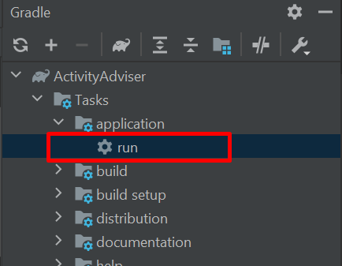

# ActivityAdviser
My first small pet-project using the javafx library. 

It's an activity adviser, which generates random activities for users: 

## How to use:

To try the adviser, the following steps can be followed:

1) Clone this repository using the command: git clone `https://github.com/yunsenaMir/ActivityAdviser.git`
2) Open project in IntellijIdea as a gradle project
3) Run the task "run" of the application plugin in the Gradle tasks section

4) Push the button "I'm bored, get an activity!" to get an activity.

The open API's [here](http://www.boredapi.com/api/activity) is used. 
